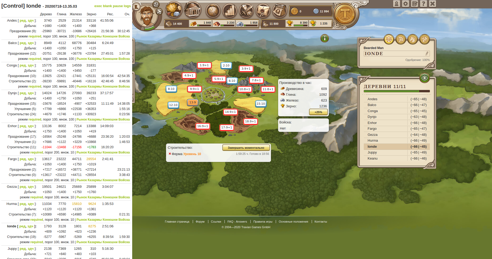

# Travian

Скрипт для автоматизации экономики в игре [Travian][travian].

- [x] Сканирование собственных деревень для отображения ресурсов и информации в одном месте
- [x] Автоматическое начало строительства зданий и/или ресурсных полей
- [x] Автоматическое переключение ресурсов героя
- [x] Автоматическое обучение войск
- [x] Автоматический запуск празднований
- [ ] Автоматическая отправка героя в приключение
- [ ] Автоматическая отправка набегов на учетные записи или автоматическая отправка волн атак
- [ ] Автоматический скан карты
- [ ] Автоматическая отправка ресурсов на другие учетные записи
- [ ] Автоматическое размещение ставок на аукционе
- [ ] Сканирование статистики других игроков

> Внимание! Автоматизация действий в игре может быть причиной бана или штрафа.

## Сборка и установка

    $ make setup
    $ make build
    
после чего готовый файл скрипта будет находиться в директории `dist`.
В игру его можно подключить с помощью инструментов типа [GraceMonkey][monkey].

[travian]: https://www.travian.com
[monkey]: https://addons.mozilla.org/ru/firefox/addon/greasemonkey/
